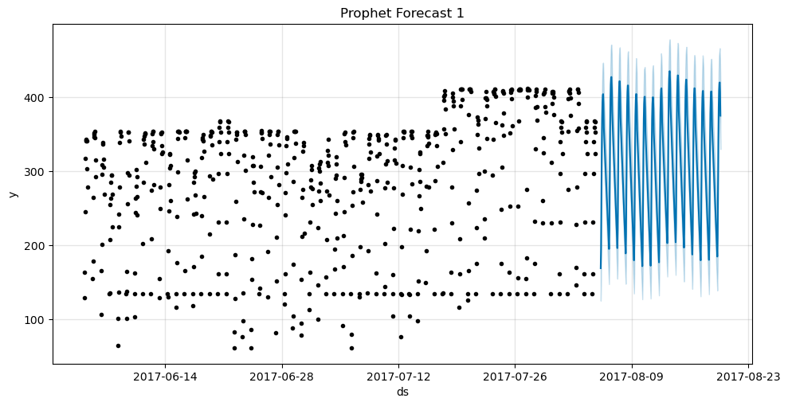
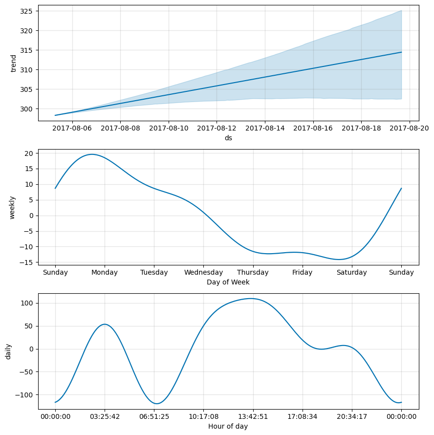

# Forecating Bus Demand

In this project, the future bus demand forecasts of municipalities were studied. The development is based on modular programming.

- [Forecating Bus Demand](#forecating-bus-demand)
  - [INSTALLATION](#installation)
  - [DATA](#data)
  - [BUILD STATUS](#build-status)
  - [INFO DATA](#info-data)
  - [MISSING DATA](#missing-data)
  - [MODEL](#model)
  - [RESULT](#result)
  - [REFERENCES](#references)

## INSTALLATION

**Python --version 3.9.13**
```
pip install pandas
pip install numpy
pip install scikit-learn
pip install matplotlib
pip install datetime
pip install prophet
```

## DATA     

The dataset includes two measurements for an hour for the number of used buses in each municipality, each measurement is timestamped. The dataset format is as follows (comma-separated values):

* TIMESTAMP: represents the exact time of the measurement
* MUNICIPALITY_ID: anonymization 
* USAGE: the number of buses in use at the time of measurement
* TOTAL_CAPACITY: represents the total number of buses in the municipality.

There are 10 municipalities (ids from 0 to 9), and two measurements for an hour.

Asked to forecast the hourly bus usage for next week for each municipality. Hence you can aggregate the two measurements for an hour by taking the max value for each hour, and you should model this data with a time series model of your selection. 
You will use the last two weeks (starting from 2017-08-05 to 2017-08-19) as assessment (test) data, hence your code should report the error (in the criterion you chose for the task) for the last two weeks.

## BUILD STATUS

The macro values defined depending on the data set are shown below. These values may need to be adjusted in studies to be carried out with a data set with different features.

```python
# Macro Definition
MUNICIPALITY_COUNT = 10
TOTAL_DATA_RAW_COUNT = 13070
TOTAL_DATA_FEATURE_COUNT = 4
EACH_MUNICIPALITY_DATA_RAW_COUNT = TOTAL_DATA_RAW_COUNT/MUNICIPALITY_COUNT
FIRST_DATE = "2017-06-04"
LAST_DATE = "2017-08-19"
TIME_COLUMN_NAME = "timestamp"
MUNICIPALITY_COLUMN_NAME = "municipality_id"
USAGE_COLUMN_NAME = "usage"
TEST_DATA_INDEX_NUMBER = 150
```

## INFO DATA

```
##################### Shape #####################
(13070, 4)
##################### Types #####################
timestamp          object
municipality_id     int64
usage               int64
total_capacity      int64
dtype: object
##################### Head #####################
             timestamp  municipality_id  usage  total_capacity
0  2017-06-04 07:59:42                9    454            1332
1  2017-06-04 07:59:42                8    556            2947
2  2017-06-04 07:59:42                4   1090            3893
3  2017-06-04 07:59:42                0    204            2813
4  2017-06-04 07:59:42                7    718            2019
5  2017-06-04 07:59:42                5     70             587
6  2017-06-04 07:59:42                2    273             697
7  2017-06-04 07:59:42                1    129             397
8  2017-06-04 07:59:42                6    597            3113
9  2017-06-04 07:59:42                3    623            1930
##################### Tail #####################
                 timestamp  municipality_id  usage  total_capacity
13060  2017-08-19 16:30:35                4   2542            3893
13061  2017-08-19 16:30:35                1    396             397
13062  2017-08-19 16:30:35                0   1271            2813
13063  2017-08-19 16:30:35                9    815            1332
13064  2017-08-19 16:30:35                5    202             587
13065  2017-08-19 16:30:35                2    548             697
13066  2017-08-19 16:30:35                8   1193            2947
13067  2017-08-19 16:30:35                7   1354            2019
13068  2017-08-19 16:30:35                6   1680            3113
13069  2017-08-19 16:30:35                3   1189            1930
##################### NA #####################
timestamp          0
municipality_id    0
usage              0
total_capacity     0
dtype: int64
##################### Quantiles #####################
                  0.000   0.050    0.500    0.950    0.990    1.000
municipality_id   0.000   0.000    4.500    9.000    9.000    9.000
usage            11.000 141.000  692.000 2558.550 3318.310 3508.000
total_capacity  397.000 397.000 1974.500 3893.000 3893.000 3893.000
##################### Corr #####################
                 municipality_id  usage  total_capacity
municipality_id            1.000  0.184           0.173
usage                      0.184  1.000           0.683
total_capacity             0.173  0.683           1.000
##################### Describe #####################
       municipality_id     usage  total_capacity
count        13070.000 13070.000       13070.000
mean             4.500   876.003        1972.800
std              2.872   679.287        1144.075
min              0.000    11.000         397.000
25%              2.000   403.000         697.000
50%              4.500   692.000        1974.500
75%              7.000  1190.000        2947.000
max              9.000  3508.000        3893.000
```

## MISSING DATA

Missing day and hour information in the data set is filled in by taking into account the average values.

```python
def fill_all_missing_values(data,missing_df,means,time_column_name,municipality_column_name):

    missing_df = missing_df.set_index(time_column_name)
    for muni in data[municipality_column_name].unique():
        for hr in rec_hours:
            missing_df[(missing_df[municipality_column_name] == muni) & (missing_df.index.hour == hr)] = missing_df[(missing_df[municipality_column_name] == muni) & (missing_df.index.hour == hr)].fillna(means[f'{muni}_{hr}'])

    final_df = pd.concat((data.set_index(time_column_name), missing_df))
    final_df = final_df.sort_index()

    return final_df
```

## MODEL

```py
def prophet_model_predict_and_plot(municipality_id):

    data_municipality_0 = pd.read_csv(f'data/preprocessed/municipality_{municipality_id}.csv',header=0).drop('municipality_id', axis=1)
    data_municipality_0['timestamp'] = data_municipality_0['timestamp'].apply(lambda date: datetime.datetime.strptime(date, "%Y-%m-%d %H:%M:%S"))
    data_municipality_0 = data_municipality_0.drop(["total_capacity"],axis=1)

    data_municipality_0.columns = ["ds","y"]

    train_data = data_municipality_0.drop(data_municipality_0.index[-TEST_DATA_INDEX_NUMBER:])
    test_data = data_municipality_0.loc[data_municipality_0.index[-TEST_DATA_INDEX_NUMBER:]]

    model = Prophet()
    model.fit(train_data)

    test_result = model.predict(test_data)

    fig, ax = plt.subplots(figsize=(10, 5))
    fig = model.plot(test_result, ax=ax)
    ax.set_title(f'Prophet Forecast {municipality_id}')

    fig = model.plot_components(test_result)
    plt.show()
```

## RESULT

Forecasted were made separately for each municipality. Below are the estimates for Municipality 1. 

The last 2 weeks in the data set were not included in the training data and the estimation of the last two weeks was studied.






## REFERENCES

* https://github.com/mcandemir/forecast-bus-demand
* https://facebook.github.io/prophet/